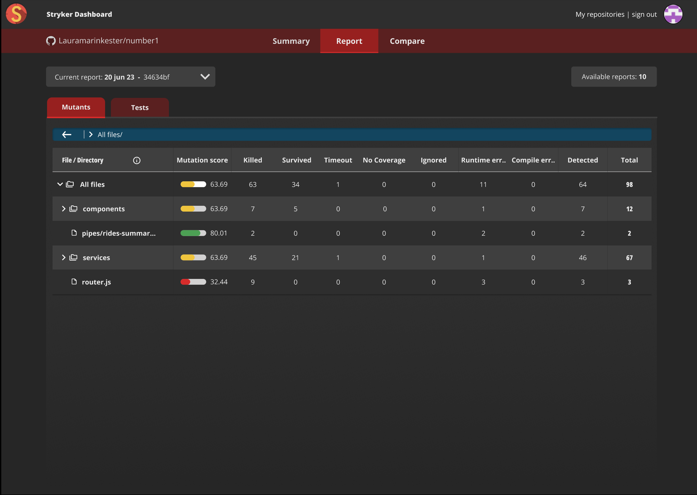

### New designs 

---

#### Interviews were held to understand:
- How Stryker dashboard is used
- Possible new features that deliver value to the user

<!-- .element class="fragment" -->

---

#### Focus area's new designs:
- Overview of important metrics at a glance
- Ability to compare reports
- Improve clarity and consistency throughout the dashboard

<!-- .element class="fragment" -->

---

---

---

---

