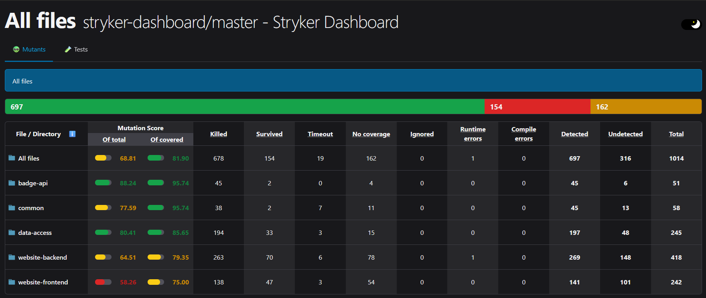

### New features 

1. [#483](https://github.com/stryker-mutator/stryker-dashboard/issues/483): Dashboard now completely uses Lit.

---

### Other

1. [#550](https://github.com/stryker-mutator/stryker-dashboard/issues/550): Improve E2E test configuration
2. [#565](https://github.com/stryker-mutator/stryker-dashboard/issues/565): Improve README.md (outdated instructions)
3. [#375](https://github.com/stryker-mutator/stryker-dashboard/issues/375): Migrate `azure-storage` to `@azure/storage-blob` and `@azure/data-tables` (by Hugo).
4. Stryker now runs correctly on the frontend and other projects.

---

<!-- .element class="fragment" -->
