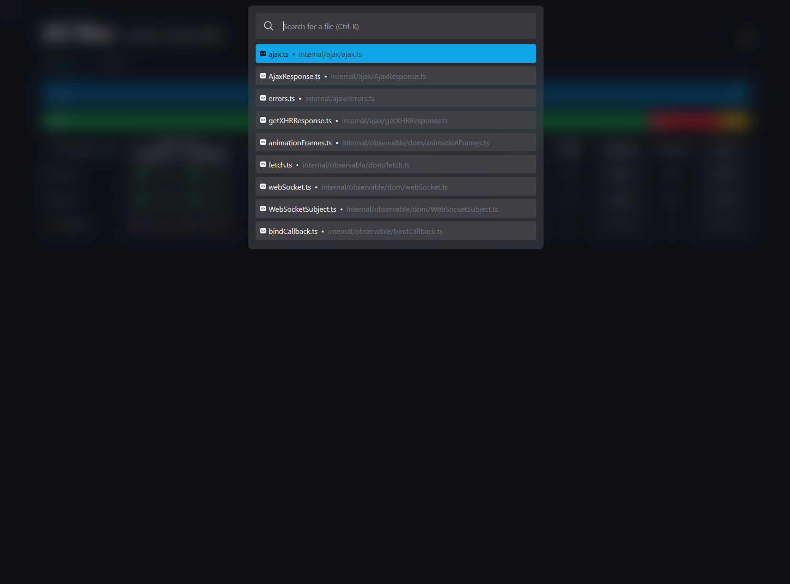
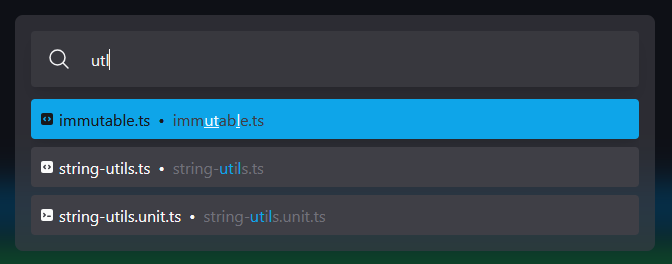
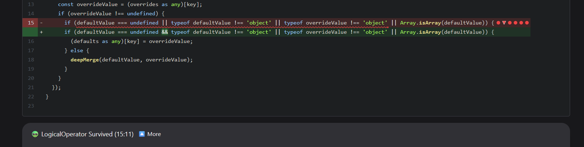

### New features 

---

#### Stryker Dashboard

- [#340](https://github.com/stryker-mutator/stryker-dashboard/issues/340) Automatically renew TLS certificate
- [#402](https://github.com/stryker-mutator/stryker-dashboard/issues/402) Add supported frameworks to the homepage

---

---

#### Mutation-testing-elements

Add keyboard shortcuts (ongoing):
- [#3370](https://github.com/stryker-mutator/mutation-testing-elements/issues/3370) Add file picker (Hacktoberfest)
- [#3370](https://github.com/stryker-mutator/mutation-testing-elements/issues/3370) Add fuzzy search to file picker

---

---

---

Other:
- [#3475](https://github.com/stryker-mutator/mutation-testing-elements/pull/3475) Make mutant dots styling more clear (Hacktoberfest)
- [#3475](https://github.com/stryker-mutator/mutation-testing-elements/pull/3475) Animate dot/triangle opening/closing
- [#3481](https://github.com/stryker-mutator/mutation-testing-elements/issues/3481) Mutation details popunder does not consider StatusReason for height

---

